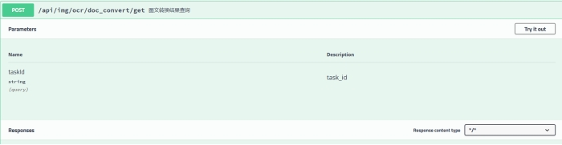

# ***\*中软杯A11文心大模型赛道（API方向）\****

## 微信小程序《探索“视界”》说明文档

### 项目结构说明
A11前端代码--->前端代码

WenXinDemo01 --->后端代码

### 大模型发展背景

 大模型的发展历史可以追溯到上个世纪80年代。当时，神经网络模型只有几层，训练数据较少。随着计算机技术的发展，神经网络模型的深度和训练数据规模逐渐增加。2006年，Hinton等人提出了深度信念网络模型，标志着深度学习进入新时代。

在接下来的几年里，随着计算机算力的提高和大数据的出现，深度学习模型变得越来越复杂，逐渐发展出了包含数百万个参数和数十层计算的大模型。这些大模型在语音识别、图像处理、自然语言处理等领域取得了显著的成果。

 2017年，Vaswani等提出了Transformer架构，它成为了当前大规模语言模型的主流架构。这一架构使得深度学习模型参数达到了上亿的规模。

 2018年，谷歌推出了基于Transformer的双向深度预训练语言模型BERT，该模型参数首次超过3亿规模。同年，OpenAI推出了生成式预训练Transformer模型GPT，大大推动了自然语言处理领域的发展。

 在此之后，基于BERT的改进模型、ELNet、RoBERTa、T5等大量新式预训练语言模型不断涌现。预训练技术在自然语言处理领域得到了蓬勃发展。

 2019年，OpenAI推出了15亿参数的GPT-2模型，能够生成连贯的文本段落。同年，英伟达推出了83亿参数的Megatron-LM模型，谷歌推出了110亿参数的T5模型。

 2020年，OpenAI推出了超大规模语言训练模型GPT-3，其参数达到了1750亿，能够实现作诗、聊天、生成代码等功能。同年，微软和英伟达联手发布了5300亿参数的MT-NLG模型。

 进入2021年，谷歌推出了Switch Transformer模型以高达1.6万亿的参数量成为史上首个万亿级语言模型。同年12月，谷歌又提出了1.2万亿参数的通用稀疏语言模型GLM，在7项小样本学习领域的性能超过GPT-3。

 可以看到，随着时间的推移，大模型的参数量和计算量不断攀升，刷新了人们对人工智能的认知。这些大模型在自然语言处理、图像识别、语音识别等领域取得了显著的成果。同时，大模型的快速发展也带来了一系列新的挑战，如如何有效利用大规模数据进行预训练、如何保证模型的隐私和安全等问题。

 在国内，超大模型的发展也十分迅速。2021年成为中国AI大模型的爆发年。商汤科技发布了拥有100亿参数量的大模型“书生（INTERN）”，这是一个相当庞大的训练工作。在训练过程中，有10个以上的监督信号帮助模型适应各种不同的视觉或NLP任务。同时，华为云联合北京大学发布了盘古NLP超大预训练模型，参数规模达2000亿。

 当下，越来越多AI领域前沿技术争相落地，逐步释放出极大的产业价值，其中最受关注的方向之一便是 大规模预训练模型（简称“大模型”），大模型不仅效果好、泛化能力强、通用性强，而且具有强大的生成能力。在此基础上，***\*AIGC（Artificial Intelligence Generated Content，人工智能生成内容）\****赛道也正在如火如荼地发展。

 中国内容产业规模庞大，领域众多，比如超过5亿用户的中国网络文学市场、国风热潮下炙手可热的千亿国漫产业、市场规模已破万亿的中国广告行业、自媒体传播与融媒体模式百花齐放的3万亿中国传媒产业等。

 

### ***\*项目具体的实现场景\****

 在分享我们的项目想法之前，请允许我先向大家简单介绍一下什么是prompt。

 人工智能领域，Prompt是是一种用于提示AI模型执行特定任务或生成特定输出的文本模板。Prompt通常包含与特定任务相关的指导性文本，以帮助模型更好地理解任务并生成相应的输出。Prompt可以用来指导模型执行特定的操作或生成特定的结果，例如生成一篇与给定主题相关的文章、识别图像中的对象等。

 Prompt工程是一种技术，用于设计和优化用于训练AI模型的Prompt。通过精心设计的Prompt，可以显著提高模型的性能和输出质量。同时，开发优质的Prompt需要一定的技巧和经验，因为Prompt需要根据具体的任务和数据集进行设计和调整。

 在AI作画中大致可以把prompt拆分为：

 

 

 显然构建prompt的好坏很大程度上影响着我们大模型生成出来的内容（可以文本、图画等等）的质量，如何构建好prompt也成为我们项目重点围绕和探索的方向。

 

 

*image-20230715115719031*

 **图1 相关新闻《ChatGPT热潮下“提示工程师”成热门职业，年薪高达34万美元！》**

 

 大模型飞速发展，在医疗、交通等等领域展现出无限的可能，甚至于说普通大众都对前沿的chatGPT等有所耳闻（当然之前也有类似人工智能方面的突破，但是这次的突破可以说是让全世界为之瞩目的）。但是众所周知，大模型是一个工具，但又不想我们传统意义上的工具那样简单上手（显然购买榔头、扫把啥的不用看说明书），大模型在使用上是天生就具有门槛。一方面真正意义上面向大众的还比较少，很多免费的体验网站里面各种“高深”的参数名称让人望而却步，另一方面即便是一个对大模型使用较为熟练的人在构思prompt时，也未必一下子就能构思出一个较好的prompt，时常还要反复修改和调试。

 （后续更多AI能力开放，也会积极加入）

 AI作画体验版（基础版），体验版（基础版）面向的是初次接触AI作画的用户，用户可以将自己喜欢的一篇文章拍摄下来，提取其中的关键词作为主体元素（即prompt的作画主体），在根据自己喜欢的风格选择想要标签（即prompt中的细节词和修饰词），点击作画即可得到一幅文段对应画作。体验版（基础版）还支持拍摄手写文段，同时你也可以选择拍摄某一个物品或者场景，通过物品和场景识别，画出对应的画作。

 AI作画高级版则是针对有一定AI作画技巧用户，支持用户去用一段话去描述画作的场景和元素（即prompt的作画主体），然后用户可以去选定对应的光影等风格元素标签（即prompt中的细节词和修饰词），点击作画即可创作出自己想要的画作。如果一时间想不起来比较好的画作的场景和元素，我们也推出了智能prompt推荐（借助EasyDL基于ERNIE 3.0大模型的文本创作），用户可以输入1到2个关键词，点击“自动生成”，即可获取到一段prompt（基于系统预设、广大用户反馈和自己收藏的prompt数据进行训练）。在风格元素标签的选取中，我们也提供了预设的一些场景，例如微信头像、写真摄影等等，用户选定场景即可自动选择若干预设的风格元素标签快速上手。

 现在该项目主要还是基于微信小程序，一方面是考虑到微信小程序依托微信能够更好的分享，以及即点即用的优点

### ***\*项目技术栈\****

 

 

 

 

 

 

 

 

 

### ***\*接口文档说明\****

http://159.75.137.185:7701/swagger-ui.html

#### *用户登录接口的相关说明*

 

 

其中登录分为手机登录和微信登录（模拟）

#### *手机验证码登录*

##### 手机验证码发送

手机登录使用/user/auth/sendMessage/{phone}（restful风格），向指定的手机号码发送6位随机验证码

发送成功

{
 "code": 200,
 "message": "成功",
 "data": {
  "phone": "19820754340",
  "status": **true**,
  "waitingTime": -1
 },
 "ok": **true**
}

 

当向同一个手机号发送两次验证码的间隔时间小于60秒时会导致短信发送失败，并在waitingTime中指明仍需等待的时间

{	
 "code": 201,
 "message": "失败",
 "data": {
  "phone": "19820754340",
  "status": **false**,
  "waitingTime": 39
 },
 "ok": **false**
}

注意验证码有效时间为5分钟，（大于60秒小于5分钟）同一个手机号再次请求获取验证码时，会销毁之前所请求的验证码，后台会缓存最新获取的验证码，请使用最新验证码进行校验。

 

##### 手机验证码验证登录

通过/user/auth/login接口传递json

application/json

{
 "code": "string",
 "ip": "string",
 "openid": "string",
 "phone": "string"
}

其中code（验证码）和手机号码（phone）是验证授权的关键参数，另外的openid是为微信授权登录预留，ip是登录设备的IP地址，用于登录的日志记录（待做TODO）

输出结果：

验证码错误

{
 "code": 210,
 "message": "验证码错误",
 "data": **null**,
 "ok": **false**
}

2.验证通过

{
 "code": 200,
 "message": "成功",
 "data": {
  "access_token": "Bearer eyJhbGciOiJSUzUxMiIsInppcCI6IkdaSVAifQ.H4sIAAAAAAAAAB3LsQrCMBCA4Xe5uYG7s_Xa7hlcMlRE1yS9QERBTAOK-O4G15_v_8B1yzAD7UdBQhIciKGDUkOrZ-suB2dOR7u0pq8HzH_IOAl2UPPaEMedJqZoNMhq-pjIeOLBSD-xShxj8qHdtejT-bu2w97eJXv4_gA_AIbifQAAAA.KJFIWV9TN7yaCUd_2W0YVd51hcPxK1D3-RBUSLgTggic_M40vulnQQuUM5Q0gHvVeDxDgvwOxc9Wker6Ef0biWaJ3thKrl_Gw_PJTSwc9ux14n13o8klwGHS-jRWL7YmSXjbl04vu10l6JKooClPRxl42Z7iKS87Xk2irz5YS_SGKZhrVQXVJHgx6Adn2wWo5Q21s76yo4mRvyCjh82CmhbwQrJUJao9brXQZbzDG9yEJQlj-tsn0G_gJM1Fb7qCwrVetKeGrUk_9-_POQv-QMcLQ6t_PW4ljwqjf9qvGPcAN9d7yw-5pgu4_IV63QrtNyZz_AULCNhHGLKxZl9d5w",
  "refresh_token": "eyJhbGciOiJSUzUxMiIsInppcCI6IkdaSVAifQ.H4sIAAAAAAAAABXLsQrCMBCA4Xe5uYFcTHtt9wwuGSqia5JeIGJBjIGK-O6e68_3f-D2KjADDiNp1Ei6twgd1BalXpy_Hr06n9wijfcHzH84oJ1Id9DKKsikA2eDSXGkVdmUUQU0vSI7GaY0phyi3K3y04eN5XD3dy0Bvj9NSjFqfQAAAA.LROiex-SB4HuSc9Pn_MGks887j-ruyI3eLB_NoThW_uYZh7nnTsecZrcHkMhb_H_O6dGE_p-CXsdGYV8sWAdsPJ9G_ML5ra8ukC-rcyH7rkBDc4jFY-HQiAnirit_-Pafbp60Ta9gtPd1o1RqGqf6YQyynG3o4DuRa9sGUGeuaqkBqOKprWYI6FM9xbATx4kjqWGV_h3r2jhpyMveATIKlWk_3hM2DrnM1AsMsDgUtdU0IfeAlUSU46dnmt9kQoSaX-XZsyOBbl4RRP4eM2MRv9eOpLw1nBjzbBgriflI9S5-GFes5g6k6e1Bx-WUGyW4V3gxOS-Fg0LN-iO5FyMFA",
  "name": "Elysia",
  "isNew": **false**
 },
 "ok": **true**
}

3.(特殊，一般不会用到)账号锁定

{
 "code": 212,
 "message": "用户已被禁用",
 "data": **null**,
 "ok": **false**
}

 

#### *百度第三方授权登录*

百度第三方授权的结构

 

 

 

#### *个人信息的上传和修改*

【通过Authorization中包含的token来确认用户】

/user/auth/completeInfo该接口可以考虑使用，所有参数都是可以选择性取舍

{
 "birth": "2023-06-01",
 "gender": 0,
 "nickName": "string",
 "phone": "string"
}

 

 

#### *头像上传*

【通过Authorization中包含的token来确认用户】

/user/auth/uploadIcon

上传文件时（与下面使用到的与上传图片的相关图像接口一样）要注意

文件的参数名为multipartFile

head中要指明Content-Type=application/json

返回包含用户头像的url

 

#### *用户ai作画的历史查询（基础版）*

【通过Authorization中包含的token来确认用户】

/user/info/history/ai_painting/text2image/base

通过get请求直接访问即可

其他历史查询亦是如此

 

 

#### *关于登录Token的相关重要说明*

##### 双token校验机制的流程图

 

 

access_token和refresh_token中存储用户名和UID（用户唯一标识码），避免存储其他敏感信息

 

##### 本项目中token校验的相关说明

当我们手机号码验证通过后会返回双token，其中access_token的有效期是24小时，refresh_token有效期是7天

在访问除登录接口以外的接口时需要在header中携带两个token（实际验证中只校验是否携带了access_token，只有但access_token验证不通过才会去校验refresh_token）

双token校验时也会校验对应token是否过期（是否位于黑名单）

默认在校验时只校验access_token，当access_token过期时才会去判断refresh_token

过期且满足head中携带的refresh_token未过期时：

{
  "code": 403,
  "message": "access_token:Bearer eyJhbGciOiJSUzUxMiIsInppcCI6IkdaSVAifQ.H4sIAAAAAAAAAB3LzQoCIRRA4Xe567mQ5s919i7auCiitupcwSiITJghevek7eE7H7i9K8wgDNkdkdGGSMMEradRLz5cDwHPJ38cjdcnzH_onNJmgl6XgWTec5EiIye7oMpFYBRSo1VOss2US0zj7o1fIT54HP6-tRrh-wPpBPBKfQAAAA.AJ6YUNsZkYb9T9WcvEEiDHJG9K7YL-jxZiwuu1-sy9Kg15PhABv9FLNs-RxiuWrr7PZJ_DhgYMNOKgtlOEjYCgYLIJWKzEwqI4e5t4FCgxaQP19nw1itksVYVNjUdEuQl5PwDe6I1k7OtqmKwBh1ZVN7AOk-upArxmzWajpNrQmoDxpkgSDHpAroW4yDTn0wRqKUkwwEigRMjAevAU2AUvo8d8CgeE9X8QgPWZpQPu-gDW0oDrOcvlP1k80yZe4bOgjEIQgOdt_3o1Wx3NmceLq3ce9uw5wqg1GK1xkQ2vXpFRZyHnty87zEY0xMI-3Bm9rZOWurtK4j2VYxts7aHQ;refresh_token:eyJhbGciOiJSUzUxMiIsInppcCI6IkdaSVAifQ.H4sIAAAAAAAAABXLzQoCIRRA4Xe56xHS8ec6exdtXBRRW3WuYDQQmVBE795te_jOB67PBgtIi26HaI31CmGCPjLXc4iXfRSnYzhwo9cdlj-0ftbGTjDaykiVmaqSRVB2q9ClSpGkMsJpr8gVLDVlvkenR0wb8RFu794SfH8-d_PJfQAAAA.PcoVUn48RtO5xHNO3WBFmqbA4uQYUU4lyu9S9Qwq447sodQxZJBuh6z3Crl25xMZRB4ks2l-wxjyx6DiezdyYPSMJvtEfZedbMCk5CDbjK8ouDsBA-Mn1_9LFO9BuQ9IktUp15BFvcvF9nuWF3ZAhOnJrE1xwyLaUxvxnWs4dt0vWBdvQboa3prlUSl4n0KPyVZf0SJ-zIJgHGLPtaPHB7N-CUF3LE0stv7oLTJ0VPx20x_csVV2leodwE620igu7rlKdeCk--h5XIap-PBtYcKQBfbZ_wiRrT6H96ufu2fN98u2irpTNhkLRu0tYmSfuAUVnhwqrdREdJ7qNNt40w",
  "data": **null**,
  "ok": **false**
}

重新获取新的access_token和refresh_token更新客户端本地存储的token

access_token放在Authorization
形式为：Bearer <token>

refresh_token放在RefreshToken

ps:

测试手机号：Elysia

 

 

测试手机号码可以绕过验证码和数据库，直接获得token

 

 

### ***\*关键功能模块分析\****

数据保存：ocr，物品识别，ai作画

#### *AI作画模块*

##### 通过图像识别生成画作

###### ***\*①文本拍照识别辅助生成法\****

***\*调用流程\****

调用imageApi下的（二选一，取决于场景）其中accurate_basic为通用场景的文本识别；handwriting为手写字体的文本识别

/api/img/ocr/accurate_basic

/api/img/ocr/handwriting

 

 

返回数据回显给前端，用户修改纠错后，调用textApi下的关键词提取接口

/api/text/nlp/keyword

 

 

获取关键词作为作画主体，引导用户选择对应风格和场景等，然后调用imageApi下的引导型作画接口获取到taskId

api/img/ai_painting/base/text2image

 

 

再调用/api/img/getText2Image获取对应的对应画作

 

ps：ai作画历史可以从这个接口获取userInfoApi下

/user/info/history/ai_painting/text2image/base

 

 

***\*接口详解\****

 用户通过移动端拍照上传图片，图片可以是关于一段印刷体文本，也可以是手写文本，通过文本通用识别和手写文字识别进行文本提取

**这两个识别是不一样的接口，在实际调用需要区分**

 后台调用接口提取出文本之后，***\*默认调用\****文本纠错对识别出来的文本进行纠正，将识别文本（已修改）和纠正结果返回到前端。

文本纠错有两个接口：基础版和高级版 
高级版： 
 
{ 
  "item": { 
    "text": "为保证各参赛团队能正常完成第十二届“中国软件杯\"大学生软件设计大赛再线报名，报名系统将延迟至2023年7月10日(周一)15:00关闭，在此之前各参赛团队均可登陆大赛官网完成在线报名口信息修改，报名截止后组委会将不再接收“开具体现指导组老师姓名的证明材料”的神请。", 
    "error_num": 5, 
    "correct_query": "为保证各参赛团队能正常完成第十二届“中国软件杯\"大学生软件设计大赛再线报名，报名系统将延迟至2023年7月10日（周一）15:00关闭，在此之前各参赛团队均可登录大赛官网完成在线报名口信息修改，报名截止后组委会将不再接收“开具体现指导组老师姓名的证明材料”的申请。", 
    "content_len": 132, 
    "details": [ 
      { 
        "sentence_fixed": "为保证各参赛团队能正常完成第十二届“中国软件杯\"大学生软件设计大赛再线报名，", 
        "begin_sentence_offset": 0, 
        "vec_fragment": [ 
          { 
            "explain_long": "缺失成对的标点符号", 
            "operation": 0, 
            "explain": "建议检查““”", 
            "label": "020200", 
            "score": 1, 
            "begin_pos": 17, 
            "end_pos": 18, 
            "ori_frag": "“", 
            "correct_frag": "“", 
            "explain_structure": "" 
          } 
        ], 
        "sentence": "为保证各参赛团队能正常完成第十二届“中国软件杯\"大学生软件设计大赛再线报名，", 
        "sentence_id": 0, 
        "end_psent_cont_offset": 132, 
        "end_sentence_offset": 38, 
        "begin_psent_cont_offset": 0 
      }, 
      { 
        "sentence_fixed": "报名系统将延迟至2023年7月10日（周一）15:00关闭，", 
        "begin_sentence_offset": 38, 
        "vec_fragment": [ 
          { 
            "explain_long": "中文段落建议使用中文符号", 
            "operation": 2, 
            "explain": "建议用中文标点“（”替换英文标点“(”", 
            "label": "020100", 
            "score": 1, 
            "begin_pos": 56, 
            "end_pos": 57, 
            "ori_frag": "(", 
            "correct_frag": "（", 
            "explain_structure": "" 
          }, 
          { 
            "explain_long": "中文段落建议使用中文符号", 
            "operation": 2, 
            "explain": "建议用中文标点“）”替换英文标点“)”", 
            "label": "020100", 
            "score": 1, 
            "begin_pos": 59, 
            "end_pos": 60, 
            "ori_frag": ")", 
            "correct_frag": "）", 
            "explain_structure": "" 
          } 
        ], 
        "sentence": "报名系统将延迟至2023年7月10日(周一)15:00关闭，", 
        "sentence_id": 1, 
        "end_psent_cont_offset": 132, 
        "end_sentence_offset": 68, 
        "begin_psent_cont_offset": 0 
      }, 
      { 
        "sentence_fixed": "在此之前各参赛团队均可登录大赛官网完成在线报名口信息修改，", 
        "begin_sentence_offset": 68, 
        "vec_fragment": [ 
          { 
            "explain_long": "", 
            "operation": 2, 
            "explain": "建议用“登录”替换“登陆”", 
            "label": "010200", 
            "score": "0.8388786911964417", 
            "begin_pos": 79, 
            "end_pos": 81, 
            "ori_frag": "登陆", 
            "correct_frag": "登录", 
            "explain_structure": "" 
          } 
        ], 
        "sentence": "在此之前各参赛团队均可登陆大赛官网完成在线报名口信息修改，", 
        "sentence_id": 2, 
        "end_psent_cont_offset": 132, 
        "end_sentence_offset": 97, 
        "begin_psent_cont_offset": 0 
      }, 
      { 
        "sentence_fixed": "报名截止后组委会将不再接收“开具体现指导组老师姓名的证明材料”的申请。", 
        "begin_sentence_offset": 97, 
        "vec_fragment": [ 
          { 
            "explain_long": "", 
            "operation": 2, 
            "explain": "建议用“申请”替换“神请”", 
            "label": "010200", 
            "score": "0.6796169877052307", 
            "begin_pos": 129, 
            "end_pos": 131, 
            "ori_frag": "神请", 
            "correct_frag": "申请", 
            "explain_structure": "" 
          } 
        ], 
        "sentence": "报名截止后组委会将不再接收“开具体现指导组老师姓名的证明材料”的神请。", 
        "sentence_id": 3, 
        "end_psent_cont_offset": 132, 
        "end_sentence_offset": 132, 
        "begin_psent_cont_offset": 0 
      } 
    ] 
  }, 
  "log_id": "1667705877535136013" 
}

前端回显用户上传图片的识别结果，用户可对文本进行修改，用户确认后点击“提交”，后台调用接口得到文本关键词返回前端，前端拿到关键词进入“作画模式”

作画模式界面设计（初稿）

 

 

这个关键词是允许用户去增添的

场景选择：动物、植物、人物、风景（待补充，

目前就支持两个场景：人像：character和风景：landscape

在后台会对场景选择进行匹配扩展，如人物会对应：精致面容，cg感，细节清晰，富有生气

点击提交，后台通过公式：“主体词+细节词+修饰词”，组合成提示词文本，通过ai作画（基础版）接口生成图像（taskId）返回给前端。

 

***\*接口说明\****

 

 

其他风格元素可以参考https://ai.baidu.com/ai-doc/NLP/qlakgh129

分辨率限定：1024x1024、1024x1536、1536x1024选择（x用*替换）

 

 

###### ***\*②通用场景识别辅助作画（针对特定某个个体）\****

 用户通过移动端拍照上传图片，图片可以是关于一个特定的植物或者动物等等，还可以是某个场景，通过通用物品和场景识别进行识别，

得到识别结果，回显识别结果，如果用户觉得识别结果有误，可以提示换角度、靠近点，多次拍照识别（通用物品和场景识别接口便宜的很，随便调），直到用户点击确认（这个接口和我们后面谈到的图像识别功能的区别是，图像识别功能突出的百科全书，是附带百科的）

接下来就和①一样，识别结果作为关键词，当然用户也可以添加关键词

 

 

 

##### AI作画高级版

偏向类似于文心一格的模式，支持图生图（上传参考图，模仿风格），目前高级版会根据文本解析进行“智能推荐”。

这一块我们要做的是根据公式：

Prompt（AI绘画描述语句）= 画面主体（画什么）+细节词（长什么样子）+风格词（是什么风格）

规范并提示用户怎么样去构建比较好的Prompt，采取一定的引导

我们现在正在探索借助EasyDL基于ERNIE 3.0大模型实现对输入文本内容进行创作和续写，对用户输入的prompt进行智能推荐

 

风格和这个类似：

 

 

 

**•** ***\*高级版prompt智能生成的相关说明\****

/api/text/nlp/prompt_generation在textApi下

 

 

{
 "maxGenLen": 0,
 "text": "string"
}

maxGenLen：生成文本字符的最长长度（0-128）默认64（建议传64）

text：关键词（如“黑发、少女”或者“黑发 少女”，格式不限）

响应格式：(text为黑发、少女为例)

{
  "code": 200,
  "message": "成功",
  "data": {
    "result": {
      "is_truncate": **false**,
      "content": "一名少女在月光下跳过溪流，她有着黑发和明亮的眼睛，身穿蓝色的和服"
    },
    "log_id": 7639209653505270328
  },
  "ok": **true**
}

 

**•** ***\*高级版作画数据保存（针对百度高级作画接口返回数据有效期较短问题）\****

老版本，每进行一次作画就会记录一次，因为加入了“用户手动保存”，不能说每进行一次作画就保存，所以将所有（输入、输出）的数据留到用户点击保存时进行保存

/api/ai_painting/saveText2ImageAdvanced在aiPaintingApi下

 

 

参数说明：

{
 "baiduUrl": "string",
 "changeDegree": 0,
 "height": 0,
 "imageNum": 0,
 "imageUrl": "string",
 "prompt": "string",
 "version": "string",
 "width": 0
}

（和作画传入的数据基本是一样的），除了一个，要传入baiduUrl，即需要保存的作画返回的图片（url）

返回该画作的永久有效的url（本地服务器存储）

 

**•** ***\*高级版反馈接口\****

/api/model/feedback/ai_painting/advanced 在modelApi下

 

 

 

{
 "evaluation": "string",
 "isUsePromptGen": "string",
 "prompt": "string",
 "review": "string",
 "subjectDescription": "string"
}

 

 

 

 

#### *智能机器人（探索中）*

借助智能对话平台UNIT构建

 

#### *智能文本创作模块*

***\*这部分我们仍在探索去其他功能进行结合\****

①图片识别，智能赋诗（图生文）

通过通用物品与场景识别接口，识别某一个场景或者物品等，回显用户确认，返回（图片url，识别结果，对应生成的一首诗），前端显示：识别不正确，重新识别试试，这个时候用户可以换角度、距离识别，直到用户点击确认，在调用接口生成诗。

 

②祝福语生成

键入以下关键词，生成祝福语

节日关键词，目前支持生成祝福语的关键词如下：平安夜 圣诞节 情人节 元旦 除夕 春节 新年 元宵节 妇女节 清明节 劳动节 端午节 国庆节 中秋节 重阳节 立春 雨水 惊蛰 春分 清明 谷雨 立夏 小满 芒种 夏至 小暑 大暑 立秋 处暑 白露 秋分 寒露 霜降 立冬 小雪 大雪 冬至 小寒 大寒 高考

 

③春联生成

输入字符串（限5字符数以内）即春联的主题，生成春联

 

 

#### *构建模型评估质量体系*

通过对AI作画模块（现阶段仅在高级版测试）进行分析，借助百度智能云的情感倾向分析和评论观点抽取接口对用户的反馈进行情感分析和观点提取进行可视化展示（后期可加入web端的管理员系统），另外通过EasyDL中的跨模态——图文匹配，对prompt和对应生成的画作进行分析，便于后续分析和优化我们的智能prompt推荐，尝试通过反馈数据不断优化prompt的生成。

 

 

 

 

 

 

 

图文匹配的数据和部署情况：

 

*image-20230715180823480*

 

 

 

### ***\*其他模块\****

#### *文件处理小助手*

##### ①图文转换器

图片（pdf）转换为word/Excel

 

 

需要传入对应文件，参数名为：multipartFile

和对应需转换的类型：image（图片）或者pdf_file（pdf文件）

响应代码样例：

{
  "code": 200,
  "message": "成功",
  "data": {
    "results": {
      "result": {
        "task_id": "EI8mqXf8"
      },
      "log_id": 1675414221875052544,
      "code": 1001,
      "success": **true**,
      "message": "Create task successfully!"
    },
    "url": "http://www.elysialove.xyz/wenxin/file/d445b42e-c589-497f-b98d-6a14e5f3fa91.pdf"
  },
  "ok": **true**
}

需要取出taskId传入查询接口获取转换结果，注意这里获取到的url是可以点击获取下载原文件的

 

 

响应样例

{
  "code": 200,
  "message": "成功",
  "data": {
    "result": {
      "start_time": "2023-07-02 16:00:53",
      "create_time": "2023-07-02 16:00:53",
      "end_time": "2023-07-02 16:00:56",
      "result_data": {
        "excel": "https://bj.bcebos.com/document-restructure/home/work/xvision/bin/build/src/web/static/zip/BaiduOCRConverter_Excel_EI8mqXf8.zip?authorization=bce-auth-v1%2F503b36e3f12c4c4c82d44ebe710cb64c%2F2023-07-02T08%3A03%3A04Z%2F2592000%2F%2F3e5b46a1b02aaf79c711772d9bb6232e71ac03a8226293424684bab906efdf11",
        "word": "https://bj.bcebos.com/document-restructure/home/work/xvision/bin/build/src/web/static/docx/EI8mqXf8/EI8mqXf8.docx?authorization=bce-auth-v1%2F503b36e3f12c4c4c82d44ebe710cb64c%2F2023-07-02T08%3A03%3A04Z%2F2592000%2F%2F6d1e7835edf4553d8b04ffc269f0d37820e0e1a252532cfef55ae8ca878ab8a2"
      },
      "task_id": "EI8mqXf8",
      "ret_msg": "已完成",
      "percent": 100,
      "ret_code": 3
    },
    "log_id": 1675414772268400640,
    "code": 1001,
    "success": **true**,
    "message": "Query task successfully!"
  },
  "ok": **true**
}

点击链接即可下载对应结果文档

 

##### ②手写字迹抹除

同样上传文件，选择文件类型

 

 

响应样例

{
  "code": 200,
  "message": "成功",
  "data": {
    "results": {
      "log_id": 1675416191198989650,
      "image_processed": "/9j/4AAQSkZJRgABAQAAAQABAAD/2wBDAAYEBQYFBAYGBQYHBwYIChAKCgkJChQODwwQFxQYGB------篇幅原原因省略"
    },
    "url": "http://www.elysialove.xyz/wenxin/file/2382c5d0-2e77-4ea9-82c5-93dee90db6e3.jpg"
  },
  "ok": **true**
}

注意输出的图片是base64格式的，注意展示和保存

效果：

输入前：

 

 

输出后：

 

 

 

#### *图像识别小助手*

提供一堆图像识别接口

##### 以通用场景识别为例

 

 

baikeNum：输出的结果前n个携带百科信息（默认为0）

topNum：输出多少个结果（默认为5）

 

### ***\*附录（备忘）\****

24.1133d82d9a5ca3746039aa836579c88a.2592000.1686992018.282335-33627159

24.d6fbc4b21303a17b5b40bf487a920e0e.2592000.1686995148.282335-33627159

24.e90f140e579894dee920aee40baa9b0b.2592000.1687008517.282335-33706789

{
  "data": {
    "style": "二次元",
    "taskId": 15973610,
    "imgUrls": [
      {
        "image": "https://wenxin.baidu.com/younger/file/ERNIE-ViLG/b470da7032d3245bc41e654c59ad43fbex"
      }
    ],
    "text": "双马尾、黑发、洛丽塔裙、唯美二次元、精致、CG渲染、高精度 4K",
    "status": 1,
    "createTime": "2023-05-18 17:15:38",
    "img": "https://wenxin.baidu.com/younger/file/ERNIE-ViLG/b470da7032d3245bc41e654c59ad43fbex",
    "waiting": "0"
  },
  "log_id": 1659125709072258000
}
